# Implémentation d'un raytracer en C++

## Présentation du projet
Au cours de projet, j'ai pu implémenter un raytracer en C++. L'idée d'un raytracer est de lancer des rayons dans une scène, de modéliser les intersection avec les objets de la scène, à l'aide de l'optique géométrique, pour en déduire la couleur de l'intersection.

Dans un premier temps, on part d'une source de lumière ponctuelle, on modélise l'intersection avec une sphère, puis on rajoute des effets optiques comme les ombres, l'éclairage indirect, l'anti-aliasing, les sphères miroir et transparentes, les sources de lumière non-ponctuelles. Enfin, on se passe des sphères et on modélise l'intersection avec un triangle, puis avec un maillage complet. En récupérant des triangulations d'objets quelconques, on peut ainsi modéliser l'intersection de la lumière avec n'importe quelle objet. On rajoute ensuite des textures.

## Eclairage direct
Le premier effet de lumière que j'ai modélisé est l'éclairage direct, avec une scène constitué d'une collection de sphères. 

Nous envoyons des rayons en direction de la sphère, nous calculons le point d'intersection, la normale au point d'intersection, le produit scalaire entre le rayon incident et la normale. 

Ensuite, nous regardons si ce point est à l'ombre : nous envoyons un nouveau rayon en direction de la lumière, et nous regardons si il y a un objet dans le trajet direct entre le point d'intersection et la lumière. Si oui, le point est à l'ombre, si non, le point est éclairé.

Formellement, le rayon **R** à pour origine le point **C**, et est lancé dans la direction **u**. La demi-droite paramétrée par le rayon est l'ensemble des points **P** = **C** + **t** * **u**, avec **t** ≥ 0.

Le rayon intersecte la sphère de centre **O**, et de rayon **R**, à condition qu'il existe un point **P** tel que :
||**P** - **O**||² = **R**² = ||**C**-**O** + **t** * **u**||²

Cela équivaut à :
**t**² + 2**t**<**C**-**O**, **u**> + ||**C**-**O**||² - **R**² = 0

On calcule **Δ** = 4<**C**-**O**, **u**>² - 4(||**C**-**O**||² - **R**²)

Si **Δ** ≤ 0, il n'y a pas d'intersection.
Si **Δ** ≥ 0, il y a intersection avec la sphère au point **P** = **C** + **t** * **u**, avec **t** la plus petite valeur qui vérifie l'équation du dessus avec **t** ≥ 0.

Une fois ce point d'intersection à l'ombre, on calcule si le point d'intersection "voit" la lumière : on renvoie un rayon depuis le point d'intersection en direction de la lumière, et si il n'y a aucune intersection avant la lumière, le point est éclairé.

Si le point est éclairé, une formule permet de calculer l'intensité lumineuse en ce point en fonction du produit scalaire entre le vecteur normal et la direction du rayon, divisé par la distance au carré à la lumière.

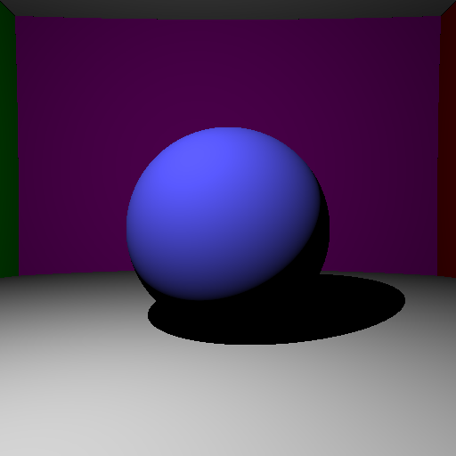

Cette image a été calculée en 160ms.

## Anti-aliasing
Le second effet que j'ai modélisé est l'anti-aliasing. L'anti-aliasing consiste à ne pas envoyer un rayon par pixel à une position fixe, mais à envoyer une collection de rayons par pixel, où l'on déplace légèrement la direction incidente du rayon entre chaque lancer, afin de mieux modéliser les frontière des objets.

Cette image a été calculée en 11s avec 128 rayons par pixel. On constate que les bordures de la sphère ainsi que l'ombre sont moins crénelées. 

## Eclairage indirect
Dans la vie réelle, les objets ne sont pas uniquement éclairés par la lumière : les objets éclairés éclairent également indirectement les autres objets autour. 

D'un point de vue implémentation, cela consiste à dire que lorsqu'on envoie un rayon et que l'on intersecte un objet, en plus de la composante liée à l'éclairage direct, nous envoyons un rayon dans une direction aléatoire, et nous calculons la couleur de l'intersection de ce second rayon avec la scène, et nous ajoutons cette contribution à l'éclairage direct. Le fait d'envoyer plusieurs rayons effectue une intégration de monte-carlo, et permet d'approcher le résultat théorique.

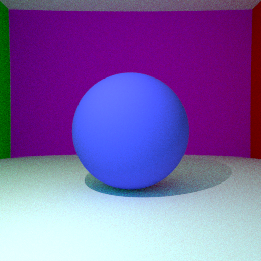

Cette image a été calculée en 56s avec 128 rayons par pixel, avec anti-aliasing et éclairage indirect. On constate que l'image est plus lumineuse : l'éclairage indirect ajoute de la lumière à l'éclairage direct.

## Sphères miroir
Dans ce projet, j'ai également implémenté des sphères miroir : on calcule l'intersection avec la sphère, et on renvoie un rayon depuis le point d'intersection dans la direction miroir.

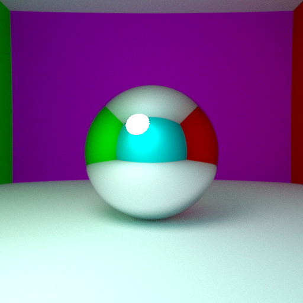

Cette image a été calculée en 260s avec 512 rayons par pixels, avec anti-aliasing, éclairage indirect, ombres douces.

## Sphères transparentes
J'ai ensuite implémenté les sphères transparentes : on spécifie un indice de réfraction, et les lois de Snell-Descartes permettent de modéliser le trajet de la lumière dans la sphère.

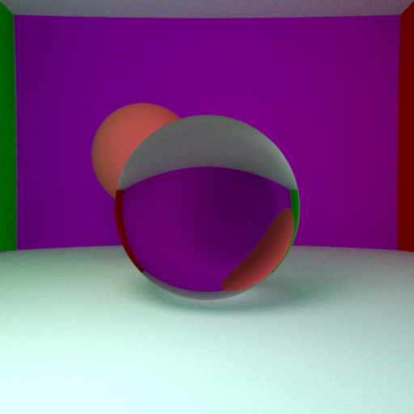

Cette image a été calculée en 260s avec 512 rayons par pixels, avec anti-aliasing, éclairage indirect, ombres douces.

## Fresnel
Dans la vraie vie, les rayons réfractés ne sont pas que réfractés, mais sont également partiellement réflechis. L'intensité de la composante réfléchie et la composante réfractée est donnée grâce aux coefficients de Fresnel.

L'implémentation des coefficients de Fresnel donne :

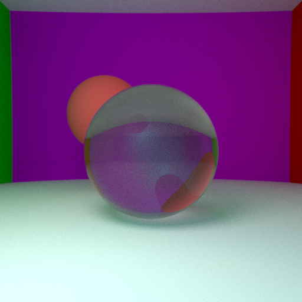

Cette image a été calculée en 274s avec 512 rayons par pixels, avec anti-aliasing, éclairage indirect, ombres douces.

## Ombres douces
J'ai également implémenté des sources de lumières non-ponctuelles. Cela permet d'avoir des ombres douces.

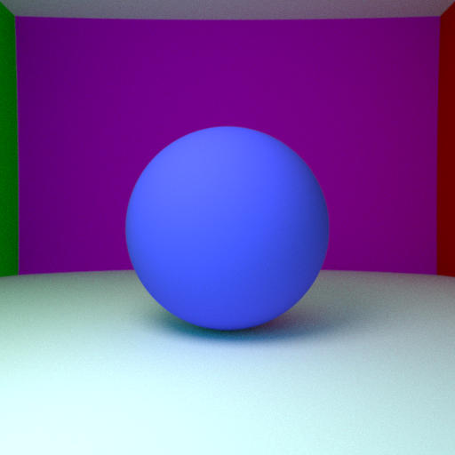

Cette image a été calculée en 260s avec 512 rayons par pixels, avec anti-aliasing, éclairage indirect, ombres douces.

## Intersection avec un maillage
Dans un second temps, nous avons abandonné les sphère, et calculé l'intersection avec des maillages. Un maillage est constitué d'un ensemble de triangles, nous avons calculé l'intersection d'un rayon avec un triangle.

Pour calculer l'intersection d'un rayon avec un triangle, nous calculons d'abord le point d'intersection du rayon avec le plan du triangle.

Un plan est défini par un point **P'** et un vecteur normal **N**. Un point **P** = **C** + **t** **u** est un point du plan si et seulement si :
<**P**-**P'**, **N**> = 0

Cela équivaut, en remplaçant **P** = **C** + **t** **u** :
**t** = - <**C**-**P'**,**N**>/<**u**,**N**>

Une fois le point d'intersection connu, on calcule les coordonnées barycentriques (α, β, γ) du point d'intersection **P**. Le point d'intersection **P** est à l'intérieur du triangle si et seulement si :
0≤α≤1
0≤β≤1
0≤γ≤1

Cela constitue notre test d'intersection avec un triangle. Pour l'intersection avec un maillage, nous calculons l'intersection avec chaque triangle du maillage, et nous gardons l'intersection la plus proche, c'est à dire celle ayant la valeur de **t** la plus faible.

Cette méthode étant extrêmement couteuse en calcul, nous effectuons 2 techniques pour améliorer le temps de calcul :

- Plutôt que de calculer pour chaque rayon l'intersection avec chaque triangle, nous calculons d'abord l'intersection du rayon avec la boite rectangulaire qui entoure l'objet. Si le rayon n'intersecte pas la boite, rien ne sert de tester l'intersection avec chaque triangle de la scène. Cela permet déjà un gain de temps conséquent.
- Nous utilisons cette idée récursivement : nous effectuons un tri rapide de la liste des triangles (selon un ordre lié à la valeur d'une certaine composante du centre de gravité du triangle), et nous utilisons une structure d'arbre. Nous testons l'intersection avec la boite englobante de l'objet, et si le rayon intersecte la boite englobante, nous testons l'intersections avec les deux sous-boites. La structure d'arbre est ainsi constituée de noeuds dont les feuilles sont des bounding box de taille de plus en plus faible, et dont les noeuds sont des triangles. Cette structure permet un calcul d'une intersection avec un maillage avec un nombre d'opérations logarithmique en le nombre de triangles du maillage.

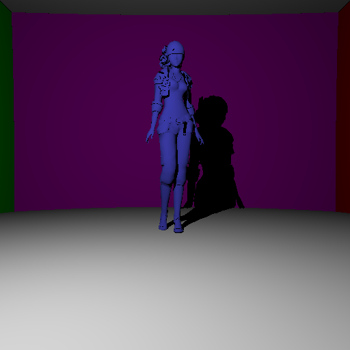

Cette image a été calculée en 1.1s avec 1 rayon par pixel, et aucun effet sauf l'éclairage direct (plusieurs centaines de secondes sans BVH), avec interpolation de normales.

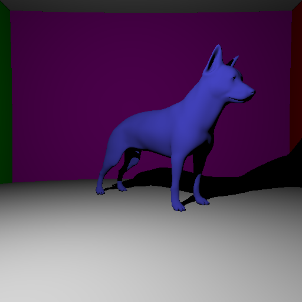

Cette image a été calculée en 7s avec 1 rayon par pixel, et aucun effet sauf l'éclairage direct (plusieurs centaines de secondes sans BVH), avec interpolation de normales.

## Textures
Une fois que le calcul efficace de l'intersection avec des maillage a été rendu possible grâce à la structure BVH, j'ai implémenté l'utilisation de textures. L'usage d'une texture modifie simplement l'albédo de l'objet, qui est ainsi une fonction du point d'intersection.

Chaque sommet du maillage contient une coordonnée UV, qui fait le mapping entre ce point et le point correspondant dans le fichier JPEG du maillage. Pour avoir la valeur en le point d'intersection, il faut interpoler les 3 valeurs des coordonnées UV des points voisins, à l'aide des coordonnées barycentriques.

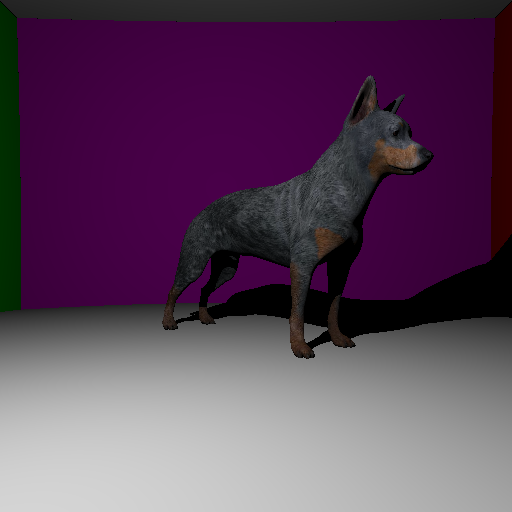

Cette image a été calculée en 6s avec 1 rayon par pixel, et aucun effet sauf l'éclairage direct (plusieurs centaines de secondes sans BVH), avec interpolation de normales.

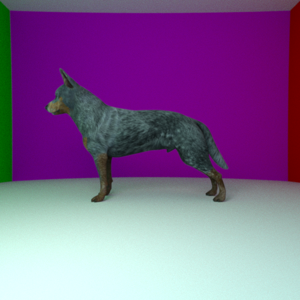
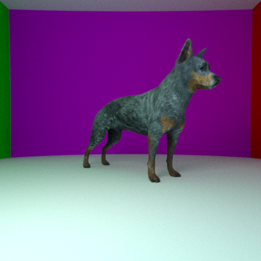

Ces deux images ont été calculées en plusieures heures avec 512 rayons par pixels, avec anti-aliasing, éclairage indirect, ombres douces et interpolation de normales.

## Retour d'expérience sur le cours
J'ai beaucoup apprécié le cours. Je le trouve très bien construit, surtout au début où les progrès sont visibles : chaque cours conduit à une nouvelle fonctionnalité dans le raytracer, ce qui est très plaisant.

Je trouve que le passage aux maillage est tout de même très compliqué : il y a beaucoup de bugs qui surviennent à ce moment la, et une séance de soutien afin de débugger les codes de ceux qui le souhaitent serait vraiment la bienvenue.

De plus, lors de mon choix de ce cours, je sous-estimais probablement la difficulté que représente l'apprentissage du C++. Ayant de l'expérience en programmation, cela a été pour moi, mais certains élèves ont eu de très grandes difficultés à s'adapter.
